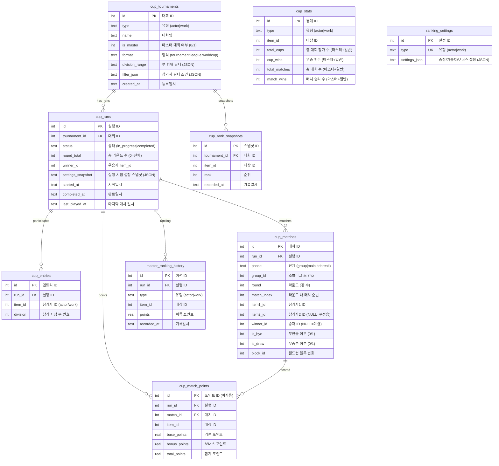

# 대회 (Cup) 도메인 ERD

```mermaid
erDiagram
    cup_tournaments {
        int id PK "대회 ID"
        text type "유형 (actor|work)"
        text name "대회명"
        int is_master "마스터 대회 여부 (0/1)"
        text format "형식 (tournament|league|worldcup)"
        text division_range "부 범위 필터 (JSON)"
        text filter_json "참가자 필터 조건 (JSON)"
        text created_at "등록일시"
    }
    cup_runs {
        int id PK "실행 ID"
        int tournament_id FK "대회 ID"
        text status "상태 (in_progress|completed)"
        int round_total "총 라운드 수 (0=전체)"
        int winner_id "우승자 item_id"
        text settings_snapshot "실행 시점 설정 스냅샷 (JSON)"
        text started_at "시작일시"
        text completed_at "완료일시"
        text last_played_at "마지막 매치 일시"
    }
    cup_entries {
        int id PK "엔트리 ID"
        int run_id FK "실행 ID"
        int item_id "참가자 ID (actor/work)"
        int division "참가 시점 부 번호"
    }
    cup_matches {
        int id PK "매치 ID"
        int run_id FK "실행 ID"
        text phase "단계 (group|main|tiebreak)"
        int group_id "조별리그 조 번호"
        int round "라운드 (강 수)"
        int match_index "라운드 내 매치 순번"
        int item1_id "참가자1 ID"
        int item2_id "참가자2 ID (NULL=부전승)"
        int winner_id "승자 ID (NULL=미결)"
        int is_bye "부전승 여부 (0/1)"
        int is_draw "무승부 여부 (0/1)"
        int block_id "월드컵 블록 번호"
    }
    cup_stats {
        int id PK "통계 ID"
        text type "유형 (actor|work)"
        int item_id "대상 ID"
        int total_cups "총 대회 참가 수 (마스터+일반)"
        int cup_wins "우승 횟수 (마스터+일반)"
        int total_matches "총 매치 수 (마스터+일반)"
        int match_wins "매치 승리 수 (마스터+일반)"
    }
    cup_match_points {
        int id PK "포인트 ID (미사용)"
        int run_id FK "실행 ID"
        int match_id FK "매치 ID"
        int item_id "대상 ID"
        real base_points "기본 포인트"
        real bonus_points "보너스 포인트"
        real total_points "합계 포인트"
    }
    master_ranking_history {
        int id PK "이력 ID"
        int run_id FK "실행 ID"
        text type "유형 (actor|work)"
        int item_id "대상 ID"
        real points "획득 포인트"
        text recorded_at "기록일시"
    }
    ranking_settings {
        int id PK "설정 ID"
        text type UK "유형 (actor|work)"
        text settings_json "승점/가중치/보너스 설정 (JSON)"
    }
    cup_rank_snapshots {
        int id PK "스냅샷 ID"
        int tournament_id FK "대회 ID"
        int item_id "대상 ID"
        int rank "순위"
        text recorded_at "기록일시"
    }

    cup_tournaments ||--o{ cup_runs : "has_runs"
    cup_tournaments ||--o{ cup_rank_snapshots : "snapshots"
    cup_runs ||--o{ cup_entries : "participants"
    cup_runs ||--o{ cup_matches : "matches"
    cup_runs ||--o{ cup_match_points : "points"
    cup_runs ||--o{ master_ranking_history : "ranking"
    cup_matches ||--o{ cup_match_points : "scored"
```
