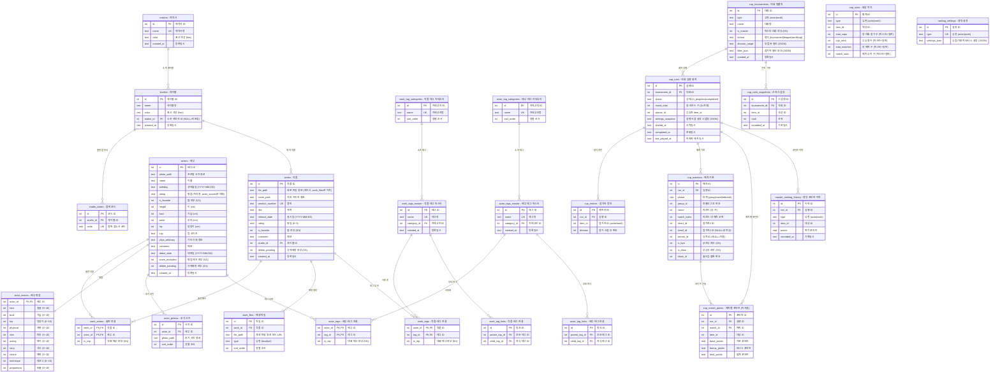

# AMNG 전체 ERD

```mermaid
erDiagram
    %% ===== Works / Actors =====
    works["works - 작품"] {
        int id PK "작품 ID"
        text file_path "원본 파일 경로 (레거시, work_files로 이전)"
        text cover_path "커버 이미지 경로"
        text product_number UK "품번"
        text title "제목"
        text release_date "출시일 (YYYY-MM-DD)"
        real rating "평점 (0~5)"
        int is_favorite "찜 여부 (0/1)"
        text comment "메모"
        int studio_id FK "레이블 ID"
        int delete_pending "삭제예정 여부 (0/1)"
        text created_at "등록일시"
    }
    actors["actors - 배우"] {
        int id PK "배우 ID"
        text photo_path "프로필 사진 경로"
        text name "이름"
        text birthday "생년월일 (YYYY-MM-DD)"
        real rating "평점 (미사용, actor_scores로 대체)"
        int is_favorite "찜 여부 (0/1)"
        int height "키 (cm)"
        int bust "가슴 (cm)"
        int waist "허리 (cm)"
        int hip "엉덩이 (cm)"
        text cup "컵 사이즈"
        text phys_arbitrary "기타 신체 정보"
        text comment "메모"
        text debut_date "데뷔일 (YYYY-MM-DD)"
        int score_excluded "평점 제외 여부 (0/1)"
        int delete_pending "삭제예정 여부 (0/1)"
        text created_at "등록일시"
    }
    work_actors["work_actors - 출연 연결"] {
        int work_id PK,FK "작품 ID"
        int actor_id PK,FK "배우 ID"
        int is_rep "대표 배우 여부 (0/1)"
    }
    work_files["work_files - 재생 파일"] {
        int id PK "파일 ID"
        int work_id FK "작품 ID"
        text file_path "재생 파일 경로 또는 URL"
        text type "유형 (local|url)"
        int sort_order "정렬 순서"
    }
    actor_scores["actor_scores - 배우 평점"] {
        int actor_id PK,FK "배우 ID"
        int face "얼굴 (0~10)"
        int bust "가슴 (0~10)"
        int hip "엉덩이 (0~10)"
        int physical "체형 (0~10)"
        int skin "피부 (0~10)"
        int acting "연기 (0~10)"
        int sexy "섹시 (0~10)"
        int charm "매력 (0~10)"
        int technique "테크닉 (0~10)"
        int proportions "비율 (0~10)"
    }
    actor_photos["actor_photos - 추가 사진"] {
        int id PK "사진 ID"
        int actor_id FK "배우 ID"
        text photo_path "추가 사진 경로"
        int sort_order "정렬 순서"
    }

    works ||--o{ work_actors : "출연 배우"
    actors ||--o{ work_actors : "출연 작품"
    works ||--o{ work_files : "재생 경로"
    actors ||--|| actor_scores : "평점"
    actors ||--o{ actor_photos : "추가 사진"

    %% ===== Studios / Makers =====
    makers["makers - 제작사"] {
        int id PK "제작사 ID"
        text name UK "제작사명"
        text color "표시 색상 (hex)"
        text created_at "등록일시"
    }
    studios["studios - 레이블"] {
        int id PK "레이블 ID"
        text name "레이블명"
        text color "표시 색상 (hex)"
        int maker_id FK "소속 제작사 ID (NULL=미분류)"
        text created_at "등록일시"
    }
    studio_codes["studio_codes - 품번 코드"] {
        int id PK "코드 ID"
        int studio_id FK "레이블 ID"
        text code UK "품번 접두사 코드"
    }

    makers ||--o{ studios : "소속 레이블"
    studios ||--o{ studio_codes : "품번 접두사"
    studios ||--o{ works : "제작 작품"

    %% ===== Tags =====
    work_tag_categories["work_tag_categories - 작품 태그 카테고리"] {
        int id PK "카테고리 ID"
        text name UK "카테고리명"
        int sort_order "정렬 순서"
    }
    actor_tag_categories["actor_tag_categories - 배우 태그 카테고리"] {
        int id PK "카테고리 ID"
        text name UK "카테고리명"
        int sort_order "정렬 순서"
    }
    work_tags_master["work_tags_master - 작품 태그 마스터"] {
        int id PK "태그 ID"
        text name UK "태그명"
        int category_id FK "카테고리 ID"
        text created_at "등록일시"
    }
    actor_tags_master["actor_tags_master - 배우 태그 마스터"] {
        int id PK "태그 ID"
        text name UK "태그명"
        int category_id FK "카테고리 ID"
        text created_at "등록일시"
    }
    work_tags["work_tags - 작품-태그 연결"] {
        int work_id PK,FK "작품 ID"
        int tag_id PK,FK "태그 ID"
        int is_rep "대표 태그 여부 (0/1)"
    }
    actor_tags["actor_tags - 배우-태그 연결"] {
        int actor_id PK,FK "배우 ID"
        int tag_id PK,FK "태그 ID"
        int is_rep "대표 태그 여부 (0/1)"
    }
    work_tag_links["work_tag_links - 작품 태그 연결"] {
        int id PK "링크 ID"
        int parent_tag_id FK "부모 태그 ID"
        int child_tag_id FK "자식 태그 ID"
    }
    actor_tag_links["actor_tag_links - 배우 태그 연결"] {
        int id PK "링크 ID"
        int parent_tag_id FK "부모 태그 ID"
        int child_tag_id FK "자식 태그 ID"
    }

    work_tag_categories ||--o{ work_tags_master : "소속 태그"
    actor_tag_categories ||--o{ actor_tags_master : "소속 태그"
    works ||--o{ work_tags : "태그 부여"
    work_tags_master ||--o{ work_tags : "사용처"
    actors ||--o{ actor_tags : "태그 부여"
    actor_tags_master ||--o{ actor_tags : "사용처"
    work_tags_master ||--o{ work_tag_links : "부모-자식"
    actor_tags_master ||--o{ actor_tag_links : "부모-자식"

    %% ===== Cup System =====
    cup_tournaments["cup_tournaments - 대회 템플릿"] {
        int id PK "대회 ID"
        text type "유형 (actor|work)"
        text name "대회명"
        int is_master "마스터 대회 여부 (0/1)"
        text format "형식 (tournament|league|worldcup)"
        text division_range "부 범위 필터 (JSON)"
        text filter_json "참가자 필터 조건 (JSON)"
        text created_at "등록일시"
    }
    cup_runs["cup_runs - 대회 실행 회차"] {
        int id PK "실행 ID"
        int tournament_id FK "대회 ID"
        text status "상태 (in_progress|completed)"
        int round_total "총 라운드 수 (0=전체)"
        int winner_id "우승자 item_id"
        text settings_snapshot "실행 시점 설정 스냅샷 (JSON)"
        text started_at "시작일시"
        text completed_at "완료일시"
        text last_played_at "마지막 매치 일시"
    }
    cup_entries["cup_entries - 참가자 명단"] {
        int id PK "엔트리 ID"
        int run_id FK "실행 ID"
        int item_id "참가자 ID (actor/work)"
        int division "참가 시점 부 번호"
    }
    cup_matches["cup_matches - 매치 기록"] {
        int id PK "매치 ID"
        int run_id FK "실행 ID"
        text phase "단계 (group|main|tiebreak)"
        int group_id "조별리그 조 번호"
        int round "라운드 (강 수)"
        int match_index "라운드 내 매치 순번"
        int item1_id "참가자1 ID"
        int item2_id "참가자2 ID (NULL=부전승)"
        int winner_id "승자 ID (NULL=미결)"
        int is_bye "부전승 여부 (0/1)"
        int is_draw "무승부 여부 (0/1)"
        int block_id "월드컵 블록 번호"
    }
    cup_stats["cup_stats - 통합 전적"] {
        int id PK "통계 ID"
        text type "유형 (actor|work)"
        int item_id "대상 ID"
        int total_cups "총 대회 참가 수 (마스터+일반)"
        int cup_wins "우승 횟수 (마스터+일반)"
        int total_matches "총 매치 수 (마스터+일반)"
        int match_wins "매치 승리 수 (마스터+일반)"
    }
    cup_match_points["cup_match_points - 매치별 포인트 (미사용)"] {
        int id PK "포인트 ID"
        int run_id FK "실행 ID"
        int match_id FK "매치 ID"
        int item_id "대상 ID"
        real base_points "기본 포인트"
        real bonus_points "보너스 포인트"
        real total_points "합계 포인트"
    }
    master_ranking_history["master_ranking_history - 랭킹 포인트 이력"] {
        int id PK "이력 ID"
        int run_id FK "실행 ID"
        text type "유형 (actor|work)"
        int item_id "대상 ID"
        real points "획득 포인트"
        text recorded_at "기록일시"
    }
    ranking_settings["ranking_settings - 랭킹 설정"] {
        int id PK "설정 ID"
        text type UK "유형 (actor|work)"
        text settings_json "승점/가중치/보너스 설정 (JSON)"
    }
    cup_rank_snapshots["cup_rank_snapshots - 순위 스냅샷"] {
        int id PK "스냅샷 ID"
        int tournament_id FK "대회 ID"
        int item_id "대상 ID"
        int rank "순위"
        text recorded_at "기록일시"
    }

    cup_tournaments ||--o{ cup_runs : "회차 실행"
    cup_tournaments ||--o{ cup_rank_snapshots : "순위 기록"
    cup_runs ||--o{ cup_entries : "참가 명단"
    cup_runs ||--o{ cup_matches : "매치 기록"
    cup_runs ||--o{ cup_match_points : "매치별 포인트"
    cup_runs ||--o{ master_ranking_history : "포인트 이력"
    cup_matches ||--o{ cup_match_points : "포인트 산출"
```
