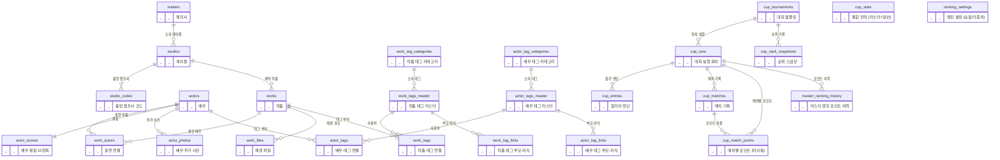

# AMNG 테이블 관계 개요

```mermaid
erDiagram
    works {
        _ _ "작품"
    }
    actors {
        _ _ "배우"
    }
    work_actors {
        _ _ "출연 연결"
    }
    work_files {
        _ _ "재생 파일"
    }
    actor_scores {
        _ _ "배우 평점 10항목"
    }
    actor_photos {
        _ _ "배우 추가 사진"
    }
    makers {
        _ _ "제작사"
    }
    studios {
        _ _ "레이블"
    }
    studio_codes {
        _ _ "품번 접두사 코드"
    }
    work_tag_categories {
        _ _ "작품 태그 카테고리"
    }
    actor_tag_categories {
        _ _ "배우 태그 카테고리"
    }
    work_tags_master {
        _ _ "작품 태그 마스터"
    }
    actor_tags_master {
        _ _ "배우 태그 마스터"
    }
    work_tags {
        _ _ "작품-태그 연결"
    }
    actor_tags {
        _ _ "배우-태그 연결"
    }
    work_tag_links {
        _ _ "작품 태그 부모-자식"
    }
    actor_tag_links {
        _ _ "배우 태그 부모-자식"
    }
    cup_tournaments {
        _ _ "대회 템플릿"
    }
    cup_runs {
        _ _ "대회 실행 회차"
    }
    cup_entries {
        _ _ "참가자 명단"
    }
    cup_matches {
        _ _ "매치 기록"
    }
    cup_match_points {
        _ _ "매치별 포인트 (미사용)"
    }
    cup_stats {
        _ _ "통합 전적 (마스터+일반)"
    }
    master_ranking_history {
        _ _ "마스터 랭킹 포인트 이력"
    }
    ranking_settings {
        _ _ "랭킹 설정 (승점/가중치)"
    }
    cup_rank_snapshots {
        _ _ "순위 스냅샷"
    }

    works ||--o{ work_actors : "출연 배우"
    actors ||--o{ work_actors : "출연 작품"
    works ||--o{ work_files : "재생 경로"
    actors ||--|| actor_scores : "평점"
    actors ||--o{ actor_photos : "추가 사진"

    makers ||--o{ studios : "소속 레이블"
    studios ||--o{ studio_codes : "품번 접두사"
    studios ||--o{ works : "제작 작품"

    work_tag_categories ||--o{ work_tags_master : "소속 태그"
    actor_tag_categories ||--o{ actor_tags_master : "소속 태그"
    works ||--o{ work_tags : "태그 부여"
    work_tags_master ||--o{ work_tags : "사용처"
    actors ||--o{ actor_tags : "태그 부여"
    actor_tags_master ||--o{ actor_tags : "사용처"
    work_tags_master ||--o{ work_tag_links : "부모-자식"
    actor_tags_master ||--o{ actor_tag_links : "부모-자식"

    cup_tournaments ||--o{ cup_runs : "회차 실행"
    cup_tournaments ||--o{ cup_rank_snapshots : "순위 기록"
    cup_runs ||--o{ cup_entries : "참가 명단"
    cup_runs ||--o{ cup_matches : "매치 기록"
    cup_runs ||--o{ cup_match_points : "매치별 포인트"
    cup_runs ||--o{ master_ranking_history : "포인트 이력"
    cup_matches ||--o{ cup_match_points : "포인트 산출"
```
