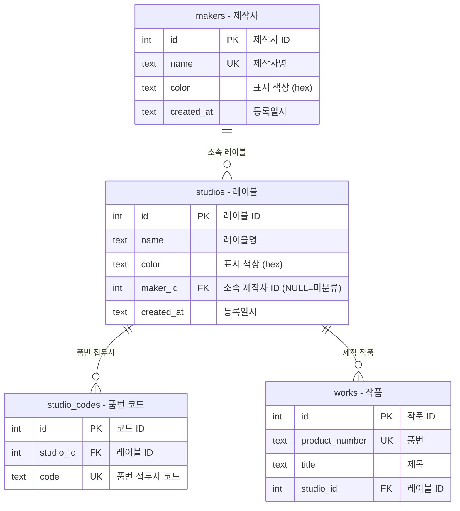

# 레이블 / 제작사 도메인 ERD

```mermaid
erDiagram
    makers["makers - 제작사"] {
        int id PK "제작사 ID"
        text name UK "제작사명"
        text color "표시 색상 (hex)"
        text created_at "등록일시"
    }
    studios["studios - 레이블"] {
        int id PK "레이블 ID"
        text name "레이블명"
        text color "표시 색상 (hex)"
        int maker_id FK "소속 제작사 ID (NULL=미분류)"
        text created_at "등록일시"
    }
    studio_codes["studio_codes - 품번 코드"] {
        int id PK "코드 ID"
        int studio_id FK "레이블 ID"
        text code UK "품번 접두사 코드"
    }
    works["works - 작품"] {
        int id PK "작품 ID"
        text product_number UK "품번"
        text title "제목"
        int studio_id FK "레이블 ID"
    }

    makers ||--o{ studios : "소속 레이블"
    studios ||--o{ studio_codes : "품번 접두사"
    studios ||--o{ works : "제작 작품"
```
