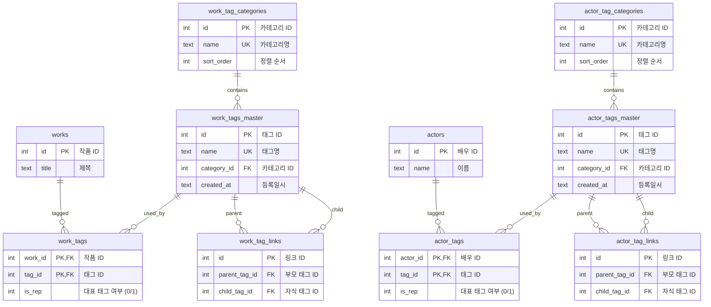

# 태그 도메인 ERD

```mermaid
erDiagram
    work_tag_categories {
        int id PK "카테고리 ID"
        text name UK "카테고리명"
        int sort_order "정렬 순서"
    }
    actor_tag_categories {
        int id PK "카테고리 ID"
        text name UK "카테고리명"
        int sort_order "정렬 순서"
    }
    work_tags_master {
        int id PK "태그 ID"
        text name UK "태그명"
        int category_id FK "카테고리 ID"
        text created_at "등록일시"
    }
    actor_tags_master {
        int id PK "태그 ID"
        text name UK "태그명"
        int category_id FK "카테고리 ID"
        text created_at "등록일시"
    }
    work_tags {
        int work_id PK,FK "작품 ID"
        int tag_id PK,FK "태그 ID"
        int is_rep "대표 태그 여부 (0/1)"
    }
    actor_tags {
        int actor_id PK,FK "배우 ID"
        int tag_id PK,FK "태그 ID"
        int is_rep "대표 태그 여부 (0/1)"
    }
    work_tag_links {
        int id PK "링크 ID"
        int parent_tag_id FK "부모 태그 ID"
        int child_tag_id FK "자식 태그 ID"
    }
    actor_tag_links {
        int id PK "링크 ID"
        int parent_tag_id FK "부모 태그 ID"
        int child_tag_id FK "자식 태그 ID"
    }
    works {
        int id PK "작품 ID"
        text title "제목"
    }
    actors {
        int id PK "배우 ID"
        text name "이름"
    }

    work_tag_categories ||--o{ work_tags_master : "contains"
    actor_tag_categories ||--o{ actor_tags_master : "contains"
    works ||--o{ work_tags : "tagged"
    work_tags_master ||--o{ work_tags : "used_by"
    actors ||--o{ actor_tags : "tagged"
    actor_tags_master ||--o{ actor_tags : "used_by"
    work_tags_master ||--o{ work_tag_links : "parent"
    work_tags_master ||--o{ work_tag_links : "child"
    actor_tags_master ||--o{ actor_tag_links : "parent"
    actor_tags_master ||--o{ actor_tag_links : "child"
```
