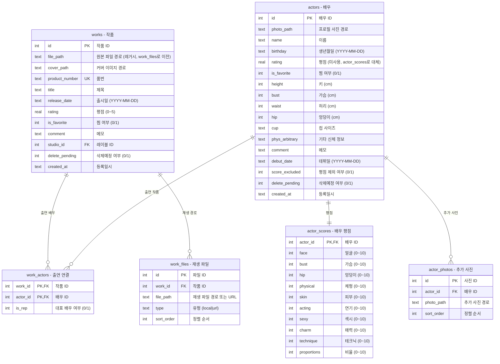

# 작품 / 배우 도메인 ERD

```mermaid
erDiagram
    works["works - 작품"] {
        int id PK "작품 ID"
        text file_path "원본 파일 경로 (레거시, work_files로 이전)"
        text cover_path "커버 이미지 경로"
        text product_number UK "품번"
        text title "제목"
        text release_date "출시일 (YYYY-MM-DD)"
        real rating "평점 (0~5)"
        int is_favorite "찜 여부 (0/1)"
        text comment "메모"
        int studio_id FK "레이블 ID"
        int delete_pending "삭제예정 여부 (0/1)"
        text created_at "등록일시"
    }
    actors["actors - 배우"] {
        int id PK "배우 ID"
        text photo_path "프로필 사진 경로"
        text name "이름"
        text birthday "생년월일 (YYYY-MM-DD)"
        real rating "평점 (미사용, actor_scores로 대체)"
        int is_favorite "찜 여부 (0/1)"
        int height "키 (cm)"
        int bust "가슴 (cm)"
        int waist "허리 (cm)"
        int hip "엉덩이 (cm)"
        text cup "컵 사이즈"
        text phys_arbitrary "기타 신체 정보"
        text comment "메모"
        text debut_date "데뷔일 (YYYY-MM-DD)"
        int score_excluded "평점 제외 여부 (0/1)"
        int delete_pending "삭제예정 여부 (0/1)"
        text created_at "등록일시"
    }
    work_actors["work_actors - 출연 연결"] {
        int work_id PK,FK "작품 ID"
        int actor_id PK,FK "배우 ID"
        int is_rep "대표 배우 여부 (0/1)"
    }
    work_files["work_files - 재생 파일"] {
        int id PK "파일 ID"
        int work_id FK "작품 ID"
        text file_path "재생 파일 경로 또는 URL"
        text type "유형 (local|url)"
        int sort_order "정렬 순서"
    }
    actor_scores["actor_scores - 배우 평점"] {
        int actor_id PK,FK "배우 ID"
        int face "얼굴 (0~10)"
        int bust "가슴 (0~10)"
        int hip "엉덩이 (0~10)"
        int physical "체형 (0~10)"
        int skin "피부 (0~10)"
        int acting "연기 (0~10)"
        int sexy "섹시 (0~10)"
        int charm "매력 (0~10)"
        int technique "테크닉 (0~10)"
        int proportions "비율 (0~10)"
    }
    actor_photos["actor_photos - 추가 사진"] {
        int id PK "사진 ID"
        int actor_id FK "배우 ID"
        text photo_path "추가 사진 경로"
        int sort_order "정렬 순서"
    }

    works ||--o{ work_actors : "출연 배우"
    actors ||--o{ work_actors : "출연 작품"
    works ||--o{ work_files : "재생 경로"
    actors ||--|| actor_scores : "평점"
    actors ||--o{ actor_photos : "추가 사진"
```
